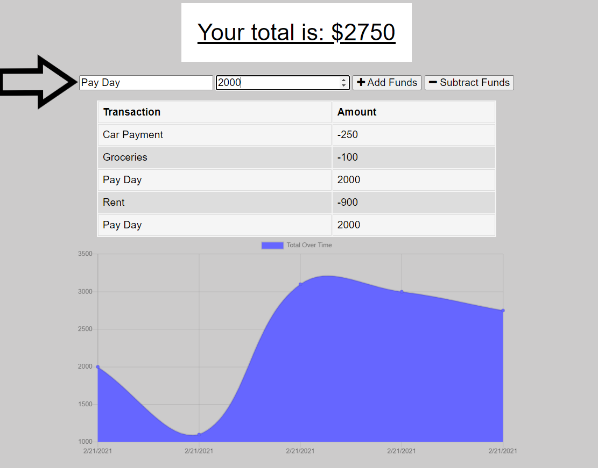
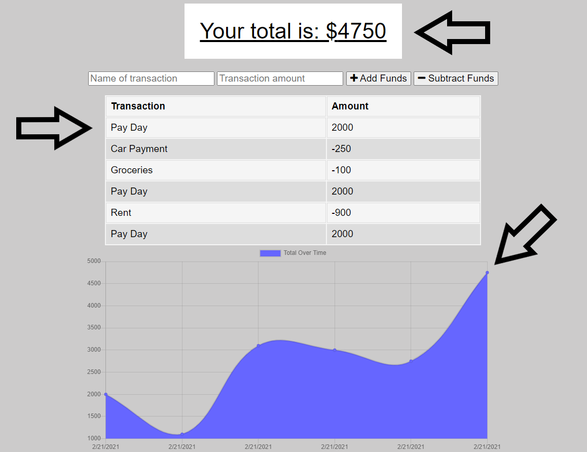

# Budget Tracker

## Overview:
This App is a budget tracking progressive web application.  It provides you with visual aids of your budget.  Since it is a PWA whether you have an internet connection or not you will be able to add and subtract from your total budget at any time.  Any transactions done while offline are stored in an IndexedDB and once you regain an internet connection all the transactions stored in the IndexedDB will be sent to the remote database and cleared off of your local machine.  This was primarily accomplished with Node, Javascript, Mongo, and IndexedDB.  

### Table of Contents:
1. [How it works](#How-it-works)
2. [Example](#Example)
3. [Installation](#Installation)
4. [Contributing](#Contributing)
5. [Questions](#Questions)
6. [License](#License)

### How it works!
Once the app is loaded the first time all the public files will be cached on your local machine.  After that you are able to use it anytime anywhere!  Simply type in the description of your transaction, enter the amount, and hit either add funds if you are depositing or subtract funds if you are withdrawing.  Once this is done the table and graph will be updated with your new transaction. 

Add Funds!      Dashboard Will Update!      

### Example
Here is a link to the Budget Tracker:  [https://vfavorito-budget-tracker.herokuapp.com/](https://vfavorito-budget-tracker.herokuapp.com/)

### Installation
If you would like to run this locally after cloning the repository run npm i to install package files.  Node and MongoDB will also need to be installed on your local machine.

### Contributing
If you would like to contribute to the development of this app the guidelines for doing so can be found here: [Contribution Covenant](https://www.contributor-covenant.org/version/2/0/code_of_conduct/code_of_conduct.txt)

### Questions?
Visit my Github profile here: [vfavorito](https://github.com/vfavorito) 
If you have any questions you can reach out to me at vince.favorito@gmail.com

### License
This App is covered under the MIT License